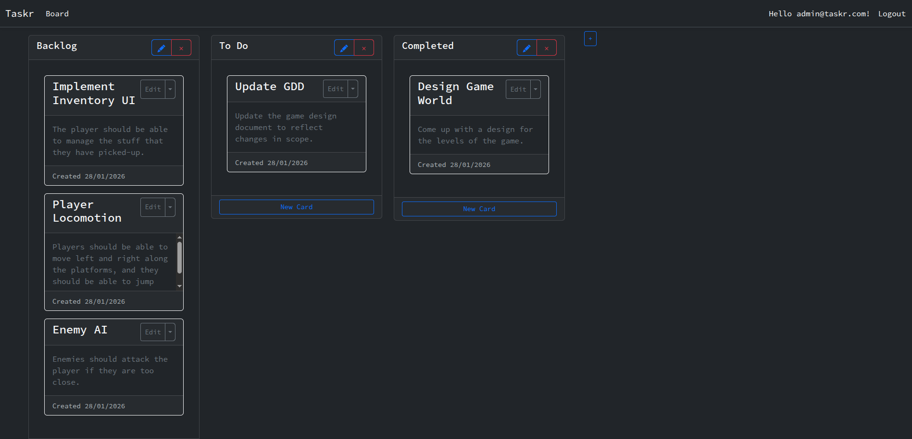

# Taskr

---

### A simple kanban tasks board created using ASP.NET Core MVC and Razor pages.


**Live Demo:** https://taskr-gafxdebgb7exdfd8.westeurope-01.azurewebsites.net/



## 🛠 Tech Stack

- **Framework:** ASP.NET Core 10.0 (MVC)
- **Language:** C# 14
- **Testing:** xUnit, FluentAssertions
- **Database:** SQL Server (Azure)
- **ORM:** Entity Framework Core
- **Frontend:** Razor Pages, Bootstrap 5, jQuery
- **Authentication:** ASP.NET Core Identity
- **Deployment:** Docker

## 🚀 Getting Started

### Prerequisites

- [.NET 10 SDK](https://dotnet.microsoft.com/download/dotnet/10.0)

### Setup (Dev)
The data will be stored in a local in-memory database.

1. **Clone the repository:**
   ```bash
   git clone https://github.com/SilenceOfTheLambdas/Taskr.git
   cd Taskr
   ```

2. **Restore dependencies:**
   ```bash
   dotnet restore
   ```

3. **Run the application:**
   ```bash
   dotnet run
   ```
   The application will be available at `https://localhost:7060` or `http://localhost:5176`.

### Docker
Docker is used for deployment, however you can adjust the Dockerfile to Development if needed.
