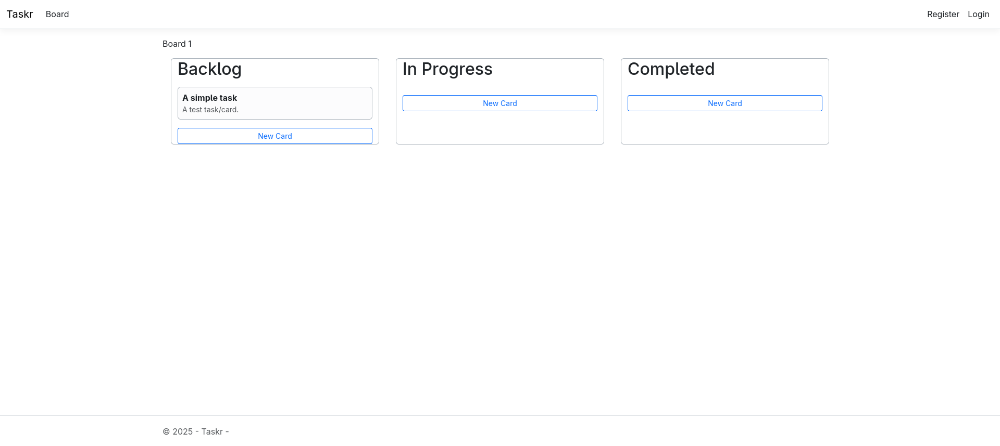

# Taskr

---

### A simple kanban tasks board created using ASP.NET Core MVC and Razor pages.




## 🛠 Tech Stack

- **Framework:** ASP.NET Core 10.0 (MVC)
- **Language:** C# 14
- **Testing:** xUnit, FluentAssertions
- **Database:** SQLite
- **ORM:** Entity Framework Core
- **Frontend:** Razor Pages, Bootstrap 5, jQuery
- **Authentication:** ASP.NET Core Identity

## 🚀 Getting Started

### Prerequisites

- [.NET 10 SDK](https://dotnet.microsoft.com/download/dotnet/10.0)

### Setup

1. **Clone the repository:**
   ```bash
   git clone https://github.com/SilenceOfTheLambdas/Taskr.git
   cd Taskr
   ```

2. **Restore dependencies:**
   ```bash
   dotnet restore
   ```

3. **Apply Database Migrations:**
   ```bash
   dotnet ef database update
   ```

4. **Run the application:**
   ```bash
   dotnet run
   ```
   The application will be available at `https://localhost:7060` or `http://localhost:5176`.

